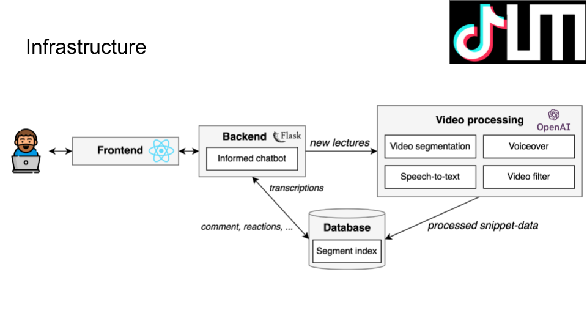

# TikTUM

## Inspiration
TikTok, Reels, and YouTube Shorts, to name a few, ushered in an era of tech companies competing for our limited attention spans. Our project aims to use these same techniques to get you addicted to content that actually matters.

## What it does
1. Automatically divide lectures into meaningful segments and display them as TikTok-style clips
2. Socialize over video clips; react, comment, share, directly ask questions about lecture segments and receive answers from students or an integrated bot with knowledge of the lecture
3. Seamlessly search through hours of video content with the help of accurate audio transcription models
4. Generate lecture subtitles in (almost) any language to even further reduce any learning barriers
5. Make learning more fun by applying filter and voiceover effects on lecture content

## How we built it
* Our video processing pipeline (built in Python) analyzes the lecture recordings and splits them into easy-to-digest segments. We first extract the individual frames, analyze the change in pixel content over time and use the silence from the audio to infer segment cues within the recording. We further analyze the slides using image-to-text to get the headlines and create an outline for the entire lecture. For tasks such as transcription, voiceover, and intelligent Q&A Chatbot we query APIs such as openAI's whisper, and openAI's GPT-3.

* Our frontend is powered by TypeScript and React and features an infinite-scroll feed, a lectures overview page with automatically-created outlines, and a search area where users can search through the lecture transcription and are displayed the results linking to the video snippets with the relevant content.

## Challenges we ran into
Finding practical methods for extracting information from video data. Limited frontend experiences. Operating solely on coffee and mate.

## Accomplishments that we're proud of
Great teamwork, everybody was helpful and supportive. Our approaches to video processing (segmentation, text extraction, voiceover effects, etc.) worked much better than initially expected.

## What's next for TikTUM
* Polls, quizzes, more interactive learning options
* Moderation (e.g. tutors, lecturers, assistants, etc.)
* More advanced video segmentation methods
* Explanatory graphics generation using stable diffusion
* Lecture live streams
* Further integration with live.rbg.tum
